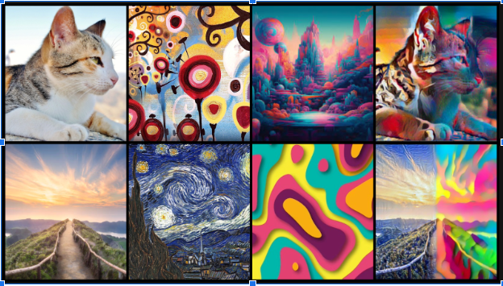

# Multi-style-Image-Transfer

# Introduction
This repository contains the implementation of a multistyle image transfer project using both TensorFlow and PyTorch frameworks. 
The goal of this project is to allow users to transfer artistic styles from one image to another while preserving the content.
We leverage the power of deep learning and neural networks to achieve impressive and visually appealing style transfers.

# Table of Contents: 
- Installation
- Usage
- Datasets
- Results

# Installation
 # 1) Clone the repository:
git clone https://github.com/your-username/multistyle-image-transfer.git
cd multistyle-image-transfer

 # 2) Install the required dependencies:

- TensorFlow 
- PyTorch 
- NumPy
- Matplotlib
- Pillow

  `pip install tensorflow torch numpy matplotlib pillow`

# Usage
# 1) Prepare your input images:

Place the content image and the style image(s) in the input directory.
Run the main script:

`python tensorflow_style_transfer.py --content content_image.jpg --style style_image.jpg`

## For TensorFlow implementation, run:
`python pytorch_style_transfer.py --content content_image.jpg --style style_image.jpg`

# 2) Find the results:

The stylized output will be saved in the output directory.

 

 

# Datasets
 We recommend using publicly available datasets for training (e.g., COCO, Flickr, etc.).

 # Results
 Sample output images and comparisons will be available in the results directory.

